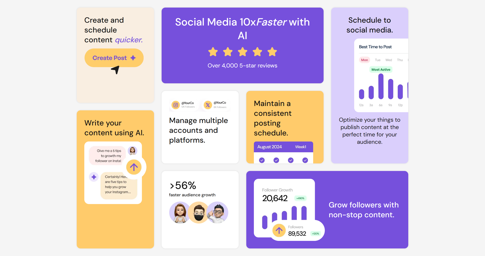

# Bento Grid — Frontend Mentor Challenge

🌐 [Live demo] (https://pettik-bento-grid.netlify.app)  
🧑‍💻 Author: [pettik](https://github.com/pettik)

## About

This project is my solution to the Frontend Mentor "Bento Grid" challenge. It demonstrates a responsive bento-style layout built primarily with modern CSS Grid (with a mobile-first approach) and semantic HTML. The layout adapts across viewports using CSS Grid areas and responsive breakpoints. The repository focuses on clean, accessible markup and pure CSS — no JavaScript required.

## What’s included

- Responsive bento grid layout using CSS Grid
- Mobile-first styles and breakpoint adjustments for tablet/desktop
- Semantic HTML structure and accessible image/text content
- All assets and source code needed to preview the layout locally or on GitHub Pages

## Built with

- HTML5
- CSS3 (Grid, Flexbox, custom properties)

## How to run locally

1. Clone the repository:
   git clone https://github.com/pettik/FrontendMentor--bento-grid.git
2. Open `index.html` in your browser (or serve the folder with a static server).

## Notes about this update

The README description has been updated to reflect the current code and implementation approach: the project emphasizes a CSS Grid-based, responsive bento layout with semantic HTML and no JavaScript. The preview image, live demo URL, and author GitHub link are intentionally preserved.

If you want me to commit this README directly to the repository, tell me and I can prepare a commit for you.
